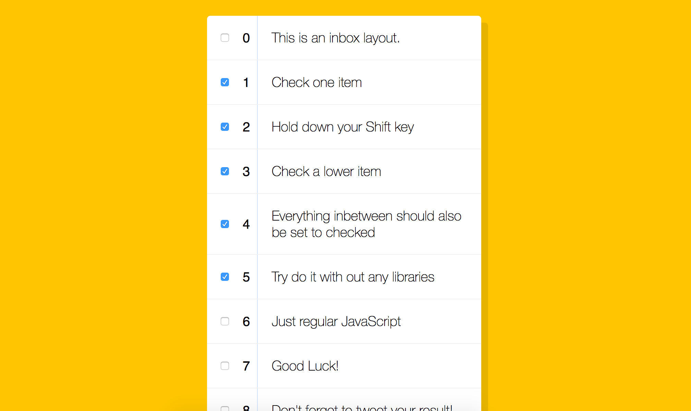

> This is a JavaScript practice with [JavaScript30](https://javascript30.com/) by [Wes Bos](https://github.com/wesbos) without any frameworks, no compilers, no boilerplate, and no libraries.

# 10 - Hold Shift and Check Checkboxes



### Fetch all the `<input>` elements and `addEventListener`

```
const checkboxes = document.querySelectorAll('.inbox input[type="checkbox"]');
checkboxes.forEach(checkbox => checkbox.addEventListener( 'click', handleCheck ));  // `click` also fire when use keyboard
```

### Checking steps

- destructuring steps
  - check an input a <- will be the `lastChecked`
  - hold shift key
  - check an input b <- will be `this`
  - then we want to all the inputs between a and b will also be checked <- `inBetween`'s inputs `.checked = true`;

- in tutorial

```
let lastChecked;

function handleCheck(e) {
  // console.log(e);
  // check if they have shift key down
  // and check that they are checking it
  let inBetween = false;
  if(e.shiftKey && this.checked) {
    // go ahead and do what we please
    // loop over every single checkbox
    checkboxes.forEach(checkbox => {
      console.log(checkbox);
      if(checkbox === this || checkbox === lastChecked) {
        inBetween = !inBetween;
        console.log('Starting to check them inbetween');
      }

      if(inBetween) {
        checkbox.checked = true;
      }
    });
  }

  lastChecked = this;
}
```

 - we defines the range of `inBetween` by `checkbox === this` and `checkbox === lastChecked`

 - checking all inputs, if it's one of the two inputs we checked, then flip the `inBetween = true`, and set all the `inBetween = true` inputs ' `.checked = true`